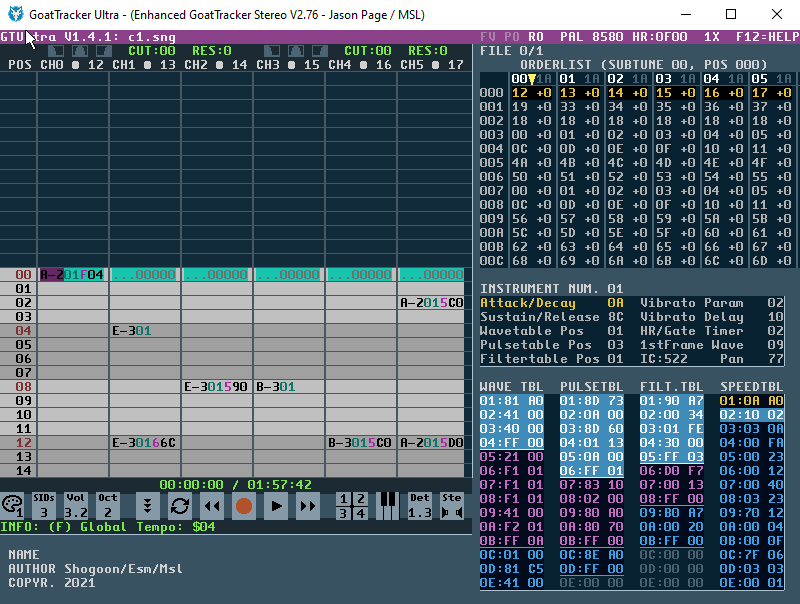

# GTUltra - V1.5.3
May 25th 2023 - Jason Page / MultiStyle Labs

## Table of Contents

- [What is it?](what-is-it.md)
- [What’s new for 1.5.0?](whats-new-150.md)
- [What’s new for 1.4.1?](whats-new-141.md)
- [What’s new for 1.3.0?](whats-new-130.md)
- [Credits:](credits.md)
- [Features compared to GTStereo](features-compared.md)
  - [1. Updated display / skinning](updated-display.md)
  - [2. Undo (ctrl-z)](undo.md)
  - [3. Instrument Use count (IC)](instrument-use-count.md)
  - [4. Instrument True Stereo Panning](instrument-true-stereo-panning.md)
  - [5. Transport bar](transport-bar.md)
    - [a. Change Skin (Mouse L/R button) - 16 default presets](transport-bar.md)
    - [b. Select SID count (Mouse L/R button - 1-4)](transport-bar.md)
    - [c. Select output volume](transport-bar.md)
    - [d. Select Octave (Mouse L/R button - 1-6)](transport-bar.md)
    - [e. Follow ON / OFF](transport-bar.md)
    - [f. Loop pattern ON / OFF](transport-bar.md)
    - [g. Selected area looping ON / OFF](transport-bar.md)
    - [h. Rewind (similar to a CD player rewind control)](transport-bar.md)
    - [i. Record ON / OFF](transport-bar.md)
    - [j. Use original GoatTracker F1-F3 keys](transport-bar.md)
    - [k. Play / Pause](transport-bar.md)
    - [l. Fast Forward](transport-bar.md)
    - [m. JAM Mode - SID chip enable](transport-bar.md)
    - [n. Display piano keyboard On/Off](transport-bar.md)
    - [o. MIDI Port Select](transport-bar.md)
    - [p. Detune (-100 cents > 100 cents)](transport-bar.md)
  - [6. True Stereo (Editor emulation only)](true-stereo.md)
  - [7. Stereo Panning](stereo-panning.md)
  - [8. 3,6,9 or 12 channel playback (1-4 SID support)](multi-channel-playback.md)
  - [9. Song pattern selection](song-pattern-selection.md)
  - [10. Song playback from anywhere](song-playback.md)
  - [11. F3 = Shift/Space](f3-shift-space.md)
  - [12. Jam Mode (when not in record mode)- Polyphonic](jam-mode.md)
  - [13. Displays note and arp chord offsets in Jam Mode](jam-mode-notes.md)
  - [14. MIDI note input](midi-note-input.md)
  - [15. Load / Save Screen (F10 / F11)](load-save-screen.md)
  - [16. Move to the previous / next pattern in a song](previous-next-pattern.md)
  - [17. Tables separated by colour](tables-by-colour.md)
  - [18. Auto-Portamento key (SHIFT-Y)](auto-portamento.md)
  - [19. Displays the overall time of the song](song-overall-time.md)
  - [20. Quick Save](quick-save.md)
  - [21. Info line](info-line.md)
  - [22. The Master Channel](master-channel.md)
  - [23. F8 = Edit Tables (‘cos Jammer said so)](f8-edit-tables.md)
  - [24. Filter Information](filter-information.md)
  - [25. Palette Editor](palette-editor.md)
  - [26. Char Editor](char-editor.md)
  - [27. F2: Changed function (if classic F1-F3 mode disabled)](f2-changed-function.md)
  - [28. Modify values with mouse](modify-values-with-mouse.md)
  - [29. Looping](looping.md)
  - [30. Copy (Ctrl-C) changes](copy-changes.md)
  - [31. Inter-pattern looping](inter-pattern-looping.md)
  - [32. Improved ENTER key functionality (moving to tables...)](improved-enter-key.md)
  - [33. Detailed Table Editing: WaveTable](wavetable-editing.md)
  - [34. Detailed Table Editing: Pulse Table](pulse-table-editing.md)
  - [35. Detailed Table Editing: Filter Table](filter-table-editing.md)
  - [36. Waveform editor](waveform-editor.md)
  - [37. MIDI Port Select](midi-port-select.md)
  - [38. Ctrl+Left / Ctrl+Right keys to quickly move to previous / next song position](previous-next-song-position.md)
  - [39. SID export](sid-export.md)
  - [40. Automatic .sng backup](automatic-sng-backup.md)
  - [41. Editor information is saved within the .sng file](editor-info-sng.md)
  - [42. Expanded OrderList View](expanded-orderlist-view.md)
  - [43. Expanded OrderList - Copy / Cut / Paste / Insert](expanded-orderlist-copy-cut-paste.md)
  - [44. Expanded OrderList - Pasting Transpose Values](expanded-orderlist-pasting-transpose.md)
  - [45. Expanded OrderList - Setting Transpose values](expanded-orderlist-setting-transpose.md)
  - [46. Expanded OrderList - Compressed Size](expanded-orderlist-compressed-size.md)
  - [47. Expanded OrderList - Repeat / End Markers](expanded-orderlist-repeat-end-markers.md)
  - [48. Disable all MIDI](disable-all-midi.md)
  - [49. Multiple .SNG support](multiple-sng-support.md)
  - [50. Export to .WAV](export-to-wav.md)
  - [51. GT2Reloc.exe](gt2reloc.md)
  - [52. Pattern order change when exporting to .SID](pattern-order-change.md)
  - [53. Auto-Advance modes](auto-advance-modes.md)
  - [54. Mouse Wheel](mouse-wheel.md)
  - [55. SIDTracker64 Mode](sidtracker64-mode.md)
  - [56. Drag and Drop to load](drag-and-drop.md)
  - [57. SID Export - Zeropage SID playback option](zeropage-sid-playback.md)
