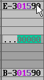

### 18. Auto-Portamento key (SHIFT-Y)

a. Press SHIFT-Y to automatically calculate portamento value for commands 1 or 2 from the pitch at cursor location to the next note in the pattern.
b. Also changes the next note to be a tie
c. Correct portamento value is added to the speed table
d. Idea taken from the BRILLIANT SIDTracker 64 by Daniel Larsson

    

    

[Back to index](index.md)
