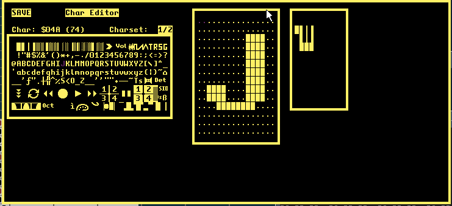

### 26. Char Editor
a. I needed to add this so that I could display nicer borders / piano keyboard and such like! Please excuse my programmer art.
b. Thank you to LMan for supplying the far better graphics!
    

c. CTRL-S or click on the SAVE text to save charset (charset.bin)
    i. If this file exists, it will automatically load when starting GTUltra.
    ii. Delete or rename charset.bin file to restore the default charset
d. Left panel
    i. Select char to edit
e. Middle panel
    i. Char editor
f. Right panel
    i. Sketch pad (draw selected char)
g. Largely untested and not exactly Photoshop - But it did the job.
h. Charset 1 / 2
    i. A second charset is used for specific purposes. Charsets can be selected by clicking on the 1 / 2 text next to the char set.

[<<<](palette-editor.md) | [index](README.md) | [>>>](f2-changed-function.md)
