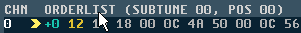
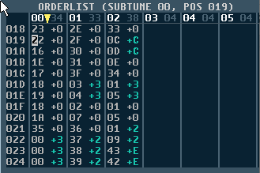
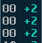

### 42. Expanded OrderList View

a. Click on the  ORDERLIST  text to toggle between  Classic  and  Expanded OrderList view.
b. Expanded orderlist:

    

    i. Shows each channels order list vertically.
    ii. Each entry has its corresponding transpose value (-F > +E)
    iii. All repeat instructions are unravelled.

        

        1. For example, in Classic view is displayed as the following in Expanded view:

            

c. When changing back to  Classic  view, the expanded orderlist  data is re-compressed - Any repeated patterns will be compressed using repeat
    counters.
d. Compressing using the repeat command can be disabled by editing an entry in the GTUltra.CFG file. This can make it easier to edit if swapping between
    views. However, it is still recommended to enable this setting when you want
    to export to .SID, so that the file size is as small as possible.

[<<<](editor-info-sng.md) | [index](README.md) | [>>>](expanded-orderlist-copy-cut-paste.md)
