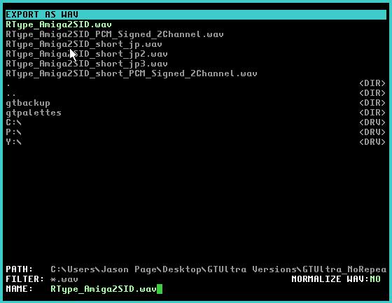

### 50. Export to .WAV

a. Press Shift (or CTRL) F11 to display this panel
b. Click on the YES or NO to enable or disable normalization
    i. Normalization on will increase the sample amplitude to the full range (making the .WAV as loud as possible without causing distortion)
    ii. If exporting individual channels to remake on another DAW, for example, it is recommended not to normalize, as this could result in some channels being noticeably different in volume than in the original .sng file

[Back to index](README.md)
