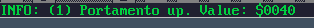

### 21. Info line
a. Displays details based on what the cursor is currently over.
b. Example1: Displaying the pattern instruction value (1 = portamento up), as well as the corresponding value from the speed table ($0040)

    

c. Example2: Displaying the filter table information:

    

[Back to index](index.md)
