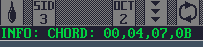
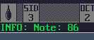

### 13. Displays note and arp chord offsets in Jam Mode

a. Holding multiple notes will display note offsets:

    

b. Holding a single note will display the number

    

[Back to index](README.md)
