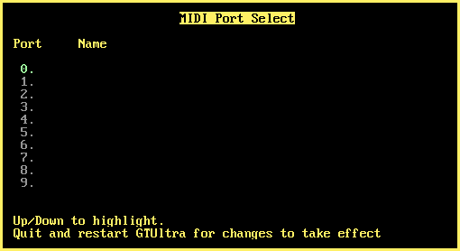

### 37. MIDI Port Select

a. Click on the keyboard icon in the transport bar, whilst holding either CTRL or SHIFT
b. This opens the MIDI Port Select Panel.
c. Use up/down to select MIDI port
d. Exit and restart GTUltra for the newly selected MIDI port to take effect.

[Back to index](README.md)
