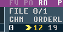

### 49. Multiple .SNG support

a. From GTUltra 1.4.1, it is possible to load two .SNG files

    

b. Click on the numbers next to FILE (above the order list view) to select a song slot.
    i. Left click - increase song slot. Right click - decrease song slot.
    ii. The display will change to display the song
    iii. Any playing / loading / saving / exporting will only affect this song
    iv. You can copy from one song and paste into another
    v. Song playback will stop when changing the FILE value

[Back to index](README.md)
