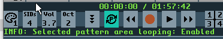

### 4. Instrument True Stereo Panning

a. See True Stereo section
### 5. Transport bar

#### a. Change Skin (Mouse L/R button) - 16 default presets

i. Ctrl Left-Click = Open Palette editor
ii. Ctrl+Shift+Left Click = Open Char editor
#### b. Select SID count (Mouse L/R button - 1-4)

i. Number of SID chips to be active during song playback
#### c. Select output volume

i. Left Mouse Button = Increase volume
ii. Right Mouse Button = Decrease volume
#### d. Select Octave (Mouse L/R button - 1-6)

i. Select octave for QWERTY note playback
#### e. Follow ON / OFF

i. On = view will follow the current playback position
ii. This can be enabled / disabled during playback
#### f. Loop pattern ON / OFF

i. On = playback will loop to start of the selected pattern when end of pattern is reached
ii. On also enables inter-pattern looping (if a section of a pattern is marked for copy/cut, this section will loop)
iii. See “Master Channel” section
#### g. Selected area looping ON / OFF

i. Shift or CTRL click on the Loop Pattern button to enable/disable
ii. A “P” will be displayed within the loop button when this feature is enabled
iii. Note: Select area looping is only enabled when Loop Pattern is also enabled

iv. 

#### h. Rewind (similar to a CD player rewind control)

i. Single left-click (or CTRL-Left Key)
