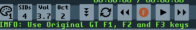

1. Move to row 0 of the selected pattern
2. If already at row 0, move to the previous song position
ii. Hold button

1. Move to the start of the song
iii. During playback / follow enabled

1. Double click to move to the previous song position
#### i. Record ON / OFF

i. On = QWERTY will play monophonic. Notes will be recorded in the currently selected pattern.
ii. Off = JAM mode. This allows for up to 12 channels to play played at one time (4 SID chips)
#### j. Use original GoatTracker F1-F3 keys

i. Press Shift or Ctrl when clicking on the RECORD button to turn this feature on or off.
ii. An “F” is displayed within the record button image when this feature is enabled

#### k. Play / Pause

i. Play = song will play from the current position
ii. Pause = song will pause at the current position
#### l. Fast Forward

i. Move to the next song position (or CTRL-Right key)
#### m. JAM Mode - SID chip enable

i. Click on 1-4 to enable/disable SID chips for jam mode
ii. Example: If a single 3 channel SID song, you could enable SID Chips 2-4 to allow you to jam over the 3 channel SID without interrupting playing notes from the song.
#### n. Display piano keyboard On/Off

i. Note: Available if MIDI is enabled

1. Disable MIDI by setting MIDIport to 9999 in .cfg file)
ii. Displays piano keyboard, showing playing notes
iii. Notes are calculated using the closest SID frequency, so this will take portamento / wild vibrato settings into account too.
#### o. MIDI Port Select

i. Press SHIFT or CTRL when clicking the piano keyboard on/off icon to open MIDI Port Select panel
#### p. Detune (-100 cents > 100 cents)

i. 1 = normal pitch (440hz = A)
ii. 0 = -100 cents
iii. 2 = +100 cents
iv. This allows for testbit effects to be tuned to the music

q.
