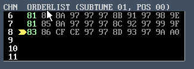

b. By default, SIDs 1+3 will play from the left speaker, and SIDs 2+4 will play

from the right speaker. However, in many cases (for example, when playing 3
SID music), it may be that you want SIDs laid out in as Left, Right, Center.
c. By Shift or Ctrl clicking on the HR: text at the top of the editor, the view will

change to the panning information for the number of SID chips that is
currently selected.
d. For example, if 3 SID chips are selected:

i. Here, you can see that P3 (Panning for 3 SID chips) information is showing 3 panning values (hard-left, hard-right and center)
e. If 4 SID chips are selected for playback, the view shows 4 values:

i. As you can see, panning is set to Left,Right,Left,Right for each SID chip
f. This panning information (a set of 4 values for SIDs 1-4) is saved in the GTUltra.cfg file

### 8. 3,6,9 or 12 channel playback (1-4 SID support)

a. 7-12 channels require 2 songs (song 0+1, song 2+3, song 4+5…)

i. This ensures that the GT Stereo file format does not need to change (yet..)
ii. 3,6 or 9 channel .SID files can be exported. .SID file format only handles up to 3 SID chips. Not all SID players handle 3 SID chips.
iii. For 12 channel (4 SIDs), these can only be played back where hardware / emulation allows (Mega65 for example).  .SID format does not allow for more than 3 SID files - so SID players will NOT work with 4SIDs
b. Example: 9 channel (3 SID) song shows SUBTUNE 01 as only 3 channels

### 9. Song pattern selection

a. Hold Left button OR shift-left click on a pattern in order list:

i. All correct patterns are selected for the song at that position
ii. Takes into consideration order lists with patterns that may have repeated n times, or channel-specific tempo changes
### 10. Song playback from anywhere

a. Double click on a pattern in order list:
