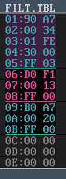
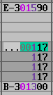

### 16. Move to the previous / next pattern in a song

a. Scrolling to top or bottom of a pattern will automatically move to the previous /

next song position, displaying correct patterns. This can be disabled by
editing the GTUltra.CFG file
### 17. Tables separated by colour

a. Sections separated with an underline when a END/LOOP (FF) is detected
b. The table entry that is used by selected instrument is highlighted
c. Unused entries (00 00) are shown as muted (grey, in this screenshot)

### 18. Auto-Portamento key (SHIFT-Y)

a. Press SHIFT-Y to automatically calculate portamento value for commands 1

or 2 from the pitch at cursor location to the next note in the pattern.
b. Also changes the next note to be a tie
c. Correct portamento value is added to the speed table
d. Idea taken from the BRILLIANT SIDTracker 64 by Daniel Larsson

>>>

### 19. Displays the overall time of the song

a. Automatically calculated when loading / modifying song
b. Time is either the length for the last channel to loop, or the first channel to

stop the song.

### 20. Quick Save
a. Ctrl-S at any time to save song using current file name
