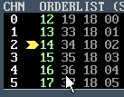
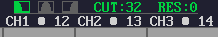
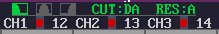

### 21. Info line
a. Displays details based on what the cursor is currently over.
b. Example1: Displaying the pattern instruction value (1 = portamento up), as

well as the corresponding value from the speed table ($0040)

c. Example2: Displaying the filter table information:

### 22. The Master Channel
a. To sync to the correct playing position, a channel needs to be selected as the

“Master”. Syncing will then take place, based on this channel. The Master
channel is defined by the cursor position. Either:

i. The channel number within the pattern editor when editing patterns
ii. The channel number within the order list
b. The Master channel is always highlighted in the OrderList view as a yellow

arrow (in this example, channel 2 is the Master Channel)

c. This then takes into consideration the different pattern lengths, pattern repeat

commands, channel-specific tempo settings within the song.
( *If ALL patterns were the same length and there were no repeat commands
in the order list or channel-specific tempo changes, life would have been far
simpler..!)

### 23. F8 = Edit Tables (‘cos Jammer said so)
a. This used to go to the Edit Name / Copyright section.
### 24. Filter Information
a. Displays the current filter type (green = active), cutoff and resonance for each

SID channel above the corresponding SID channels

b. Also highlights when a channel has filter enabled (red dot)

### 25. Palette Editor
a. CTRL+Left Click on skin icon in transport bar
b. This will display palette information
