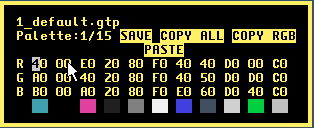
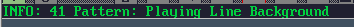

c. Each column displays RGB for a specific area (8 bits)
d. INFO text explains what each RGB is used for

e. There are 16 palettes to choose from

i. File name and palette index is displayed
f. Press Ctrl-S or left-click on the SAVE text to save a palette file.

i. User generated palette files will load automatically when starting GTUltra, if it is found within the gtpalettes folder.
ii. Ctrl-S will automatically save over the existing palette file, if one has already been selected.
g. Press Ctrl-C to top current RGB (or click Copy RGB)
h. Click on COPY ALL to copy all RGBs for this preset
i. Press Ctrl-V or click PASTE to paste either current RGB or ALL (overwrites all RGBs for palette), depending on what was last copied.
j. WARNING: NO UNDO.
### 26. Char Editor
a. I needed to add this so that I could display nicer borders / piano keyboard and

such like! Please excuse my programmer art.
b. Thank you to LMan for supplying the far better graphics!

c. CTRL-S or click on the SAVE text to save charset (charset.bin)

i. If this file exists, it will automatically load when starting GTUltra.
ii. Delete or rename charset.bin file to restore the default charset
d. Left panel

i. Select char to edit
e. Middle panel
