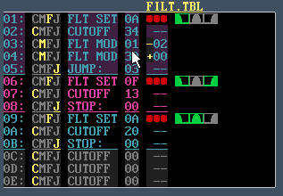

### 34. Detailed Table Editing: Pulse Table

a. Clicking on the PULSETBL title decodes the pulse table data and displays it

in a more user-friendly way

i. Click on the title again to show the original table view

b. For each row, you can select functionality by clicking either

i. S: “PLS SET”  Set Pulse Width (0-$FFF)
ii. M: “PLS MOD”  Modify Pulse Width (left column = time,  right column=speed)
iii. J: Jump (1-$FF or 0 to Stop)
c. When modifying pulse width, the right column (speed can be change from +

to - by clicking on the + or - symbol
d. Remember that the combination of CTRL-C / CTRL-V can be used to quickly

copy & paste single entries
### 35. Detailed Table Editing: Filter Table

a. Clicking on the FILT.TBL title decodes the filter table data and displays it in a

more user-friendly way

i. Click on the title again to show the original table view
b. For each row, you can select functionality by clicking either

i. C: “CUTOFF ” Set Filter Cutoff (0-$FF)
ii. M: “FLT MOD”  Modify Filter Cutoff (left column =  time, right column=speed)
iii. F: “ FLT SET”  Filter Info (Resonance, Channel On/Off,  Filter Type)
