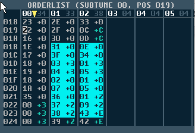

b. Expanded orderlist:

i. Shows each channels order list vertically.
ii. Each entry has its corresponding transpose value (-F > +E)
iii. All repeat instructions are unravelled.

1. For example, in Classic view is displayed as the following in Expanded view:

c. When changing back to  Classic  view, the expanded orderlist  data is

re-compressed - Any repeated patterns will be compressed using repeat
counters.
d. Compressing using the repeat command can be disabled by editing an entry

in the GTUltra.CFG file. This can make it easier to edit if swapping between
views. However, it is still recommended to enable this setting when you want
to export to .SID, so that the file size is as small as possible.
### 43. Expanded OrderList - Copy / Cut / Paste / Insert

a. Right click / drag to select multiple rows and channels
b. CTRL_C / CTRL_V / CTRL_X to copy/paste/cut
c. Unlike the classic view, CTRL_V (paste) will  not  insert  new rows prior to

pasting.
d. To insert copied data in expanded view, use CTRL_I to insert the clipboard
