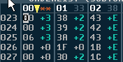
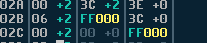

### 44. Expanded OrderList - Pasting Transpose Values

a. If the cursor position is in the transpose column when pasting, only the

transpose values are set
### 45. Expanded OrderList - Setting Transpose values

a. When the cursor is in the + or - column, use keys + or - to set the transpose

direction
b. When the cursor is in the transpose value column, use keys 0-F (or 0-E for

positive transpose) to set the value
c. If you change the transpose value of a currently playing pattern within the

orderlist, you will hear the difference in pitch instantly (in  Classic  view, the
transpose value is only refreshed when playback starts a new pattern)
### 46. Expanded OrderList - Compressed Size

a. When a .sng is saved or is exported, it is still done so in classic mode. This

ensures that the data size is still as small as possible.
b. In Expanded mode, is it possible to create order list data that is too large - the

number of entries does not compress to under 256 bytes of data.
c. The current compressed data size is shown at the top of the expanded

orderlist view. In the case above, you can see:

i. Channel 00:  **
ii. Channel 01: 33
iii. Channel 02: 38
d. The  **  shows that the size of the channel is invalid  (over 256 bytes). As such,

it is not possible to swap back to the classic view  -  or the .sng to be
saved or exported  -  until the data in this channel  has been reduced to a valid
size.
### 47. Expanded OrderList - Repeat / End Markers

a. In  Classic  view, the RPT marker  at the end of an  order list dictates the

position to loop to.
b. In  Expanded  view, this is the same. However, the marker  is shown as the

value FF
c. In the Expanded  view, it is possible to have up to  2048 (0x800) entries (based

on a compressed order list that uses R0 (repeat 16) multiple times). As such,
the loop values are converted to this larger range when a song is expanded.
d. Other than this, the same rules apply:

i. A value that is lower than the FF position will cause the channel to loop to the position specified
