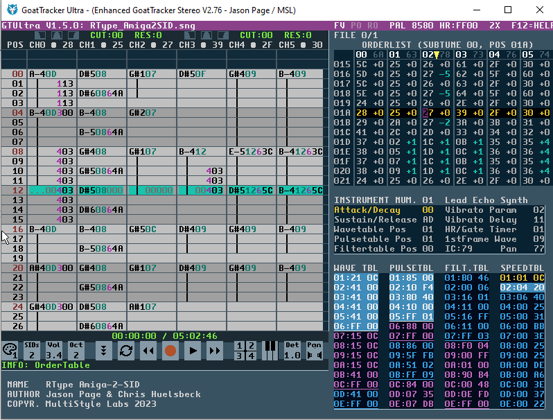

b. This was originally released with the 3 channel GoatTracker. However, it was

not included in GTStereo (which GTUltra is based upon).
### 52. Pattern order change when exporting to .SID

a. The original GoatTracker will export patterns in order, based on if they are

used within a song.
b. For example, if pattern 0 is used, that will be stored in the .SID file first.
c. In 1.5.0 update, the order is based on when the pattern is played within the

.sng. For example, if pattern 6 is played first in the song, then it will be stored
first in the .SID file.
d. Why? This makes it easier to track and reuse memory if a pattern is no longer

going to play again, if used in a game or demo with tight memory restrictions
### 53. Auto-Advance modes

a. There are now 3 different auto-advance modes (SHIFT-Z) when entering

data, depending on where cursor is within pattern area

i. Notes only (advance if you enter a note, rest, key on or key off. NOT if you are entering hex data)
ii. All (Advance when entering notes or values)
iii. OFF (no auto advance)
### 54. Mouse Wheel

a. Use the mouse wheel to scroll through panels, depending on where your

flashing editor cursor is currently located
### 55. SIDTracker64 Mode

a. NOTE: This mode is not compatible with standard GT editor mode. Key

OFF does not react in the same way. Songs created in this mode will
sound different in standard GT mode
