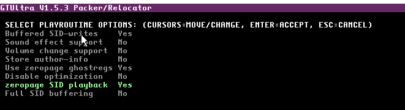

b. Enable / Disable using Shift (or CTRL) F12
c. This makes GT work a little more like SIDTracker64.

i. This is the editor I feel most at home with. All changes here are for my own personal benefit!
ii. Instruments automatically key OFF when a rest is reached (a blank space)
iii. Pressing ENTER to enter a key ON command will fill blank notes from the previous note to the cursor position with keyON
iv. Display is changed to show Key ON as vertical lines instead of +++
d. F2-F3 keys are different:

i. F2 = Play current pattern from the cursor position
ii. F3 = Play current pattern from the beginning
e. Multiple KeyOn commands are now also compressed when exporting to .SID

file in the same manner as when there is a gap between notes (where the
note and note length is stored. Now, the keyon and keyon length is stored if
necessary)
### 56. Drag and Drop to load

a. Drag .sng files and drop them into the GTUltra editor window to automatically

load them
b. No need to use F10 to find / load a .sng now
### 57. SID Export - Zeropage SID playback option

a. Usually, if exporting with Use zeropage ghostregs is enabled, no audio is

heard - a programmer has to write code to copy the zero page RAM to the
SID registers.
b. Enabling zeropage SID playback will also write the zeropage RAM to SID

registers, whilst still allowing a programmer to access the zeropage values to
perform syncing graphics to specific SID waveforms, for example.
c. 3 channel SID option only.

