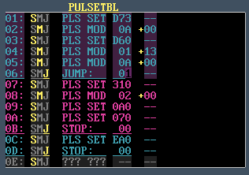

### 34. Detailed Table Editing: Pulse Table

a. Clicking on the PULSETBL title decodes the pulse table data and displays it in a more user-friendly way
    i. Click on the title again to show the original table view

        

b. For each row, you can select functionality by clicking either
    i. S: “PLS SET”  Set Pulse Width (0-$FFF)
    ii. M: “PLS MOD”  Modify Pulse Width (left column = time,  right column=speed)
    iii. J: Jump (1-$FF or 0 to Stop)
c. When modifying pulse width, the right column (speed can be changed from + to - by clicking on the + or - symbol)

    
d. Remember that the combination of CTRL-C / CTRL-V can be used to quickly copy & paste single entries

[Back to index](index.md)
