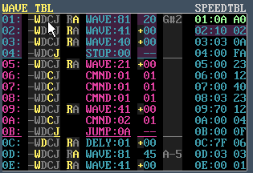

### 33. Detailed Table Editing: WaveTable

a. Clicking on the WAVE TBL title decodes the table data and displays it in a more user-friendly way
    i. Click on the title again to show the original table view

        

b. For each row, you can select functionality by clicking either
    i. -: Skip left column - only process note info in right column)
    ii. W: WAVE Set Waveform (0-$DF)
    iii. D: DELY Set Delay ($1-$F)
    iv. C: CMND Set Command (1-$F)
    v. J: JUMP Jump (1-$FF or 0 to Stop)
c. If WAVE or DELAY is specified above, you can then also set the note (pitch) information in the right column.
d. Note information can be either Relative or Absolute (offset from the note that is initially played.)

    

    i. Select either R or A for Relative or Absolute note values
    ii. Disabling both leaves the pitch unmodified
e. For Relative notes, you can also click on the + or - to swap between positive or negative offsets

    
f. Pressing ENTER when the cursor is on a command value will move the cursor to the correct entry within the speed table (if applicable)
g. Remember that the combination of CTRL-C / CTRL-V can be used to quickly copy & paste single entries

[Back to index](README.md)
